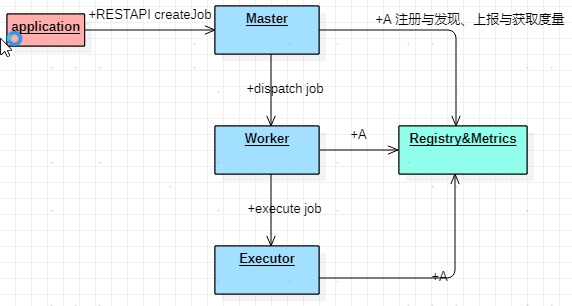
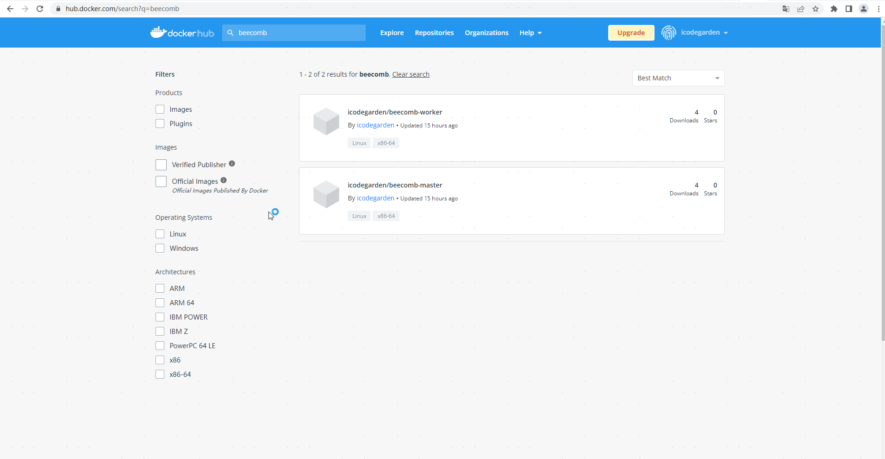

# 概览

beecomb是一个大规模、高可靠的任务调度系统，与传统定时任务调度系统不同的是beecomb特别适合大规模的延迟（delay）任务、调度（schedule）任务

如果你有诸如延时退款、抢票平台等面向N个有各自调度对象，或分批处理大批量数据、并行分片处理大数据的任务场景，beecomb或许就是你想要的

beecomb也能作为传统定时任务调度系统

# 架构



* Registry&Metrics 注册中心、高性能轻量数据读写，使用zookeeper
* Master 感知Worker的压力，负载均衡分发任务给Worker；任务自动恢复处理；RESTAPI；可视化web
* Worker 实际的任务调度引擎，管理延迟（delay）任务、调度（schedule）任务；感知Executor的压力，负载均衡决定任务让哪个Executor执行
* Executor 任务执行器，任务执行代码在这里
* Application 使用beecomb的业务应用系统，可以使用beecomb client SDK，可以跟Executor是一个应用

# 特性

* 大规模任务，由于beecomb分布式部署水平扩容、数据水平切分、调度与执行器解耦等设计，大规模集群可支持千万级任务（活跃任务）
* 高可靠保障，数据持久化，集群实例故障时任务自动恢复
* 高精度时间，每个任务在什么时间执行是比较精确的
* 智能压力负载均衡，任务在集群中将根据调度引擎、执行器的cpu、内存、已分配的任务数量进行负载均衡
* 分片并行执行任务
* 多系统支持
* 可视化Web

# 环境要求
* Java 8及以上
* Zookeeper（不低于3.6.0，推荐3.7.0及以上）
* Mysql 5.7（推荐8.0及以上）

# 下载
下载压缩包 https://gitee.com/icodegarden/beecomb/releases

# 快速开始
下面展示如何快速开始使用

## 创建数据库
创建2个database（beecomb使用shardingsphere分库），可以在相同mysql实例上
```bash
create DATABASE `beecomb_0`;
create DATABASE `beecomb_1`;
```

## 初始化数据库
下载 [scripts/mysql文件夹](./scripts/mysql) ，在2个database中都执行初始化脚本 init.sql、mysql_sequence.sql

## 启动master
[下载](#下载) beecomb-master-{version}.tar.gz 并解压，修改config/下的配置（zookeeper地址，mysql地址等），使用bin/startup.sh启动（windows用bin/startup.cmd）
```bash
bin/startup.sh
```

## 启动worker
[下载](#下载) beecomb-worker-{version}.tar.gz 并解压，修改config/下的配置（zookeeper地址，mysql地址等），使用bin/startup.sh启动（windows用bin/startup.cmd）
```bash
bin/startup.sh
```

## 编写JobHandler
下载 [beecomb-executor-sample](./beecomb-executor-sample)，下面是QuickStartJobHandler.java代码
```java
public class QuickStartJobHandler implements JobHandler {
	public static final String NAME = "QuickStartAppJobHandler";

	@Override
	public String name() {
		return NAME;
	}

	@Override
	public ExecuteJobResult handle(Job job) throws Exception {
		System.out.println("handle job:" + job);

		if (job instanceof DelayJob) {
			int delay = ((DelayJob) job).getDelay();
			System.out.println(delay);
		}	
	
		return new ExecuteJobResult();// 执行成功
	}
}
```

## 启动Executor和注册JobHandler
下载 [beecomb-executor-sample](./beecomb-executor-sample)，下面的代码在 QuickStartApp.java
```java
ZooKeeper zookeeper = new ZooKeeper(zkConnectString);
ZooKeeperSupportInstanceProperties properties = new ZooKeeperSupportInstanceProperties(zookeeper);
BeeCombExecutor beeCombExecutor = BeeCombExecutor.start(EXECUTOR_NAME, properties);
List<JobHandler> jobHandlers = Arrays.asList(new QuickStartJobHandler());
beeCombExecutor.registerReplace(jobHandlers);
```

## 创建Client
下载 [beecomb-executor-sample](./beecomb-executor-sample)，下面的代码在 QuickStartApp.java，在本例中Executor和Application是同一个应用
```java
Authentication authentication = new BasicAuthentication("beecomb", "beecomb");//client认证方式
ZooKeeper zooKeeper = new ZooKeeper(zkConnectString);
ZooKeeperClientProperties clientProperties = new ZooKeeperClientProperties(authentication, zooKeeper);
BeeCombClient beeCombClient = new ZooKeeperBeeCombClient(clientProperties);
```

## 创建任务
下载 [beecomb-executor-sample](./beecomb-executor-sample)，下面的代码在 QuickStartApp.java
```java
/**
 * 创建延迟任务，达到延迟后 {@link QuickStartAppJobHandler} 将触发任务执行
*/
Delay delay = new CreateDelayJobDTO.Delay(3000);
CreateDelayJobDTO job = new CreateDelayJobDTO("QuickStartDelayJob", EXECUTOR_NAME, QuickStartJobHandler.NAME,
    delay);
CreateJobVO response = beeCombClient.createJob(job);
```

## 更多示例
更多示例见 SampleApp.java

## 打开Web
访问 {master地址}:9898 默认用户密码beecomb/beecomb

# 开发者
## Executor
任务的执行是在Executor中的JobHandler中进行的，每个Executor都可以有N个JobHandler，开发者需要做的就是编写JobHandler

首先引入maven依赖
```xml
<dependency>
	<groupId>io.github.icodegarden</groupId>
	<artifactId>beecomb-executor</artifactId>
	<version>最新版本可在maven中央仓库找到</version>
</dependency>
```

编写JobHandler
```java
public class QuickStartJobHandler implements JobHandler {	
        @Override
	public String name() {		
	}
	@Override
	public ExecuteJobResult handle(Job job) throws Exception {		
	}
}
```

启动Executor并注册JobHandler
```java
BeeCombExecutor beeCombExecutor = BeeCombExecutor.start(EXECUTOR_NAME, properties);
List<JobHandler> jobHandlers = Arrays.asList(new QuickStartJobHandler());
beeCombExecutor.registerReplace(jobHandlers);
```

可以看到JobHandler有name，BeeCombExecutor也有name，任务该由哪个Executor的哪个JobHandler处理，正是由name决定的，创建job时每个job都需要executorName和jobHandlerName

## Application
业务应用需要能够创建、查询任务，java语言可以直接使用Client SDK，非java语言可以使用[restapi](#restapi)

首先引入maven依赖
```xml
<dependency>
	<groupId>io.github.icodegarden</groupId>
	<artifactId>beecomb-client-java</artifactId>
	<version>最新版本可在maven中央仓库找到</version>
</dependency>
```

使用Client创建任务
```java
BeeCombClient beeCombClient = new ZooKeeperBeeCombClient(clientProperties);
beeCombClient.createJob(...);
```
创建任务的详细参数见[restapi](#restapi)介绍

## restapi
restapi认证使用basic auth，即使用http header Authorization:base64(username:password)

### 创建任务
接口地址 POST openapi/v1/jobs

path参数
|参数   |类型   |是否必填   |长度   |描述   |示例值   |
|---|---|---|---|---|---|
|async   |boolean   |N   |1   |是否异步处理，默认true   |true   |

body参数
|参数   |类型   |是否必填   |长度   |描述   |示例值   |
|---|---|---|---|---|---|
|uuid   |string   |N   |0-64   |任务的uuid，注意beecomb并不会保证该值唯一性，而是由用户自己决定   |j21ccde2334   |
|name   |string   |Y   |1-30   |任务名   |jname   |
|type   |string   |Y   |枚举Delay, Schedule   |任务类型   |Delay   |
|executorName   |string   |Y   |1-30   |任务由哪个Executor执行   |e1   |
|jobHandlerName   |string   |Y   |1-30   |任务由哪个JobHandler执行   |j1   |
|priority   |int   |N   |1-10   |任务的优先级，默认5，仅在任务恢复时起作用   |5   |
|weight   |int   |N   |1-5   |任务的重量，默认1，该值对负载压力的计算起作用，例如Executor配置的overload.jobs.max是10000，则Executor能负载10000个重量是1、执行频率是1秒1次的任务，或负载4000个重量是5、执行频频率2秒1次的任务   |e1   |
|parallel   |boolean   |N   |1   |是否并行任务，默认false   |false   |
|maxParallelShards   |int   |N   |2-64   |最大并行分片数，默认8，当合格的Executor数大于等于该值时，按该值分片，小于时按实际Executor数分片   |8   |
|executeTimeout   |int   |N   |1000-3600000    |任务执行超时毫秒，默认10000   |10000   |
|params   |string   |N   |65535   |任务执行的参数   |id=100   |
|desc   |string   |N   |200   |任务描述   |我的任务   |
|delay   |Delay   |当type是Delay时必须   |1   |delay参数   |   |
|schedule   |Schedule   |当type是Schedule时必须   |1   |schedule参数   |   |

|Delay|
|参数   |类型   |是否必填   |长度   |描述   |示例值   |
|---|---|---|---|---|---|
|delay   |int   |Y   |1000-31536000000000    |任务的延迟执行时间毫秒   |60000   |
|retryOnExecuteFailed   |int   |N   |0-N   |当任务执行失败时重试次数，默认0   |3   |
|retryBackoffOnExecuteFailed   |int   |N   |1000-N   |重试回退时间毫秒，默认3000   |10000   |
|retryOnNoQualified   |int   |N   |0-N   |当任务执行没有合格的Executor时重试次数，默认0   |3   |
|retryBackoffOnNoQualified   |int   |N   |5000-N   |重试回退时间毫秒，默认30000   |30000   |

|Schedule|
|参数   |类型   |是否必填   |长度   |描述   |示例值   |
|---|---|---|---|---|---|
|scheduleFixRate   |int   |N   |1000-31536000000000    |任务执行FixRate时间毫秒   |60000   |
|scheduleFixDelay   |int   |N   |1000-31536000000000    |任务执行FixDelay时间毫秒   |60000   |
|sheduleCron   |string   |N   |符合cron   |任务cron   |0 0/2 * * * *   |
scheduleFixRate、scheduleFixDelay、sheduleCron必选其一

响应参数
|参数   |类型   |是否必填   |长度   |描述   |示例值   |
|---|---|---|---|---|---|
|job   |Job   |Y   |1   |job的返回参数   |   |
|dispatchException   |string   |N   |0-N   |dispatch失败时有   |   |

|Job|
|参数   |类型   |是否必填   |长度   |描述   |示例值   |
|---|---|---|---|---|---|
|id   |long   |Y   |1-N   |任务的唯一序列   |1   |
|uuid   |string   |N   |0-64   |任务的uuid   |j21ccde2334   |
|name   |string   |Y   |1-30   |任务名   |jname   |
|type   |string   |Y   |枚举Delay, Schedule   |任务类型   |Delay   |
|priority   |int   |N   |1-10   |任务的优先级，默认5，仅在任务恢复时起作用   |5   |
|weight   |int   |N   |1-5   |任务的重量   |e1   |
|queued   |boolean   |Y   |1   |任务是否已队列   |true   |
|queuedAtInstance   |string   |N   |1-N   |任务已队列时对应的地址   |145.23.12.3:19898   |

### 查询任务（id）
接口地址 GET openapi/v1/jobs/{id}

path参数
|参数   |类型   |是否必填   |长度   |描述   |示例值   |
|---|---|---|---|---|---|
|id   |long   |Y   |1-N   |任务id   |1   |

响应参数
|参数   |类型   |是否必填   |长度   |描述   |示例值   |
|---|---|---|---|---|---|
|id   |long   |Y   |1-N   |任务的唯一序列   |1   |
|uuid   |string   |N   |0-64   |任务的uuid，注意beecomb并不会保证该值唯一性，而是由用户自己决定   |j21ccde2334   |
|name   |string   |Y   |1-30   |任务名   |jname   |
|type   |string   |Y   |枚举Delay, Schedule   |任务类型   |Delay   |
|executorName   |string   |Y   |1-30   |任务由哪个Executor执行   |e1   |
|jobHandlerName   |string   |Y   |1-30   |任务由哪个JobHandler执行   |j1   |
|priority   |int   |N   |1-10   |任务的优先级   |5   |
|weight   |int   |N   |1-5   |任务的重量   |e1   |
|parallel   |boolean   |N   |1   |是否并行任务，默认false   |false   |
|maxParallelShards   |int   |N   |2-64   |最大并行分片数   |8   |
|queued   |boolean   |Y   |1   |任务是否已队列   |true   |
|queuedAt   |string   |N   |yyyy-MM-dd HH:mm:ss格式   |进队列时间   |2021-05-01 12:12:12   |
|queuedAtInstance   |string   |N   |1-N   |任务已队列时对应的地址   |145.23.12.3:19898   |
|lastTrigAt   |string   |N   |yyyy-MM-dd HH:mm:ss格式   |上次触发时间   |2021-05-02 12:01:02   |
|lastTrigResult   |string   |N   |0-200   |上次触发结果   |   |
|lastExecuteExecutor   |string   |N   |0-N   |上次有哪个执行器执行   |145.23.12.3:19898   |
|lastExecuteReturns   |string   |N   |0-200   |上次执行任务返回结果，这是你自己写的返回参数   |id=200   |
|lastExecuteSuccess   |boolean   |Y   |1   |上次执行是否成功   |true   |
|executeTimeout   |int   |N   |1000-3600000    |任务执行超时毫秒   |10000   |
|nextTrigAt   |string   |N   |yyyy-MM-dd HH:mm:ss格式   |下次触发时间   |2021-05-02 12:01:30   |
|end   |boolean   |Y   |1   |任务是否结束   |false   |
|createdBy   |string   |Y   |1-30   |任务创建者   |beecomb   |
|createdAt   |string   |N   |yyyy-MM-dd HH:mm:ss格式   |任务创建时间   |2021-05-02 12:12:12   |
|params   |string   |N   |65535   |任务执行的参数   |id=100   |
|desc   |string   |N   |200   |任务描述   |我的任务   |
|delay   |Delay   |当type是Delay时   |1   |delay参数   |   |
|schedule   |Schedule   |当type是Schedule时   |1   |schedule参数   |   |

|Delay|
|参数   |类型   |是否必填   |长度   |描述   |示例值   |
|---|---|---|---|---|---|
|delay   |int   |Y   |0-N   |任务的延迟执行时间毫秒   |60000   |
|retryOnExecuteFailed   |int   |N   |0-N   |当任务执行失败时重试次数，默认0   |3   |
|retryBackoffOnExecuteFailed   |int   |N   |1000-N   |重试回退时间毫秒，默认3000   |10000   |
|retriedTimesOnExecuteFailed   |int   |Y   |0-N   |已重试次数，默认0   |2   |
|retryOnNoQualified   |int   |N   |0-N   |当任务执行没有合格的Executor时重试次数，默认0   |3   |
|retryBackoffOnNoQualified   |int   |N   |5000-N   |重试回退时间毫秒，默认30000   |30000   |
|retriedTimesOnNoQualified   |int   |Y   |0-N   |已重试次数，默认0   |2   |

|Schedule|
|参数   |类型   |是否必填   |长度   |描述   |示例值   |
|---|---|---|---|---|---|
|scheduleFixRate   |int   |N   |1-N   |任务执行FixRate时间毫秒   |60000   |
|scheduleFixDelay   |int   |N   |1-N   |任务执行FixDelay时间毫秒   |60000   |
|sheduleCron   |string   |N   |符合cron   |任务cron   |0 0/2 * * * *   |
|scheduledTimes   |int   |Y   |0-N   |已调度次数   |2   |
scheduleFixRate、scheduleFixDelay、sheduleCron必选其一

### 查询任务（uuid）
接口地址 GET  openapi/v1/jobs/uuid/{uuid}

path参数
|参数   |类型   |是否必填   |长度   |描述   |示例值   |
|---|---|---|---|---|---|
|uuid   |string   |Y   |1-N   |任务uuid   |j21ccde2334   |

响应参数，同 查询任务（id）

### 分页查询任务
接口地址 GET  openapi/v1/jobs

path参数
|参数   |类型   |是否必填   |长度   |描述   |示例值   |
|---|---|---|---|---|---|
|uuid   |string   |N   |1-N   |任务uuid   |j21ccde2334   |
|nameLike   |string   |N   |1-N   |任务名模糊，左匹配   |jname   |
|type   |string   |N   |枚举Delay, Schedule   |任务类型   |Delay   |
|parallel   |boolean   |N   |1   |是否并行任务   |false   |
|lastExecuteSuccess   |boolean   |N   |1   |上次执行是否成功   |true   |
|queued   |boolean   |N   |1    |任务是否已队列   |true   |
|end   |boolean   |N   |1   |任务是否结束   |false   |
|page   |int   |N   |1-N   |第几页，从1开始，默认1，最大1000   |1   |
|size   |int   |N   |1-N   |每页几条，默认10，最大100   |10   |

响应header
|参数   |类型   |是否必填   |长度   |描述   |示例值   |
|---|---|---|---|---|---|
|X-Total-Pages   |int   |Y   |1-1000   |总页数，最大1000   |10   |

响应参数，是 查询任务（id） 的jsonarray格式

### 更新任务
接口地址 PUT openapi/v1/jobs

body参数
|参数   |类型   |是否必填   |长度   |描述   |示例值   |
|---|---|---|---|---|---|
|id   |long   |Y   |1-N   |任务的唯一序列   |1   |
|name   |string   |N   |1-30   |任务名   |jname   |
|executorName   |string   |N   |1-30   |任务由哪个Executor执行   |e1   |
|jobHandlerName   |string   |N   |1-30   |任务由哪个JobHandler执行   |j1   |
|priority   |int   |N   |1-10   |任务的优先级   |5   |
|weight   |int   |N   |1-5   |任务的重量   |e1   |
|maxParallelShards   |int   |N   |2-64   |最大并行分片数   |8   |
|executeTimeout   |int   |N   |1000-3600000    |任务执行超时毫秒，默认1000   |1000   |
|params   |string   |N   |65535   |任务执行的参数   |id=100   |
|desc   |string   |N   |200   |任务描述   |我的任务   |
|delay   |Delay   |当type是Delay时可选   |1   |delay参数   |   |
|schedule   |Schedule   |当type是Schedule时可选   |1   |schedule参数   |   |

|Delay|
|参数   |类型   |是否必填   |长度   |描述   |示例值   |
|---|---|---|---|---|---|
|delay   |int   |Y   |1000-31536000000000    |任务的延迟执行时间毫秒   |60000   |
|retryOnExecuteFailed   |int   |N   |0-N   |当任务执行失败时重试次数，默认0   |3   |
|retryBackoffOnExecuteFailed   |int   |N   |1000-N   |重试回退时间毫秒，默认3000   |10000   |
|retryOnNoQualified   |int   |N   |0-N   |当任务执行没有合格的Executor时重试次数，默认0   |3   |
|retryBackoffOnNoQualified   |int   |N   |5000-N   |重试回退时间毫秒，默认30000   |30000   |

|Schedule|
|参数   |类型   |是否必填   |长度   |描述   |示例值   |
|---|---|---|---|---|---|
|scheduleFixRate   |int   |N   |1000-31536000000000    |任务执行FixRate时间毫秒   |60000   |
|scheduleFixDelay   |int   |N   |1000-31536000000000    |任务执行FixDelay时间毫秒   |60000   |
|sheduleCron   |string   |N   |符合cron   |任务cron   |0 0/2 * * * *   |
scheduleFixRate、scheduleFixDelay、sheduleCron选其一

响应参数
|参数   |类型   |是否必填   |长度   |描述   |示例值   |
|---|---|---|---|---|---|
|id   |long   |Y   |1-N   |任务的唯一序列   |1   |
|success   |boolean   |Y   |1   |是否成功；注意如果更新任务的执行时间，则从更新时间开始重新计时   |true   |


### 删除任务
接口地址 DELETE openapi/v1/jobs/{id}

path参数
|参数   |类型   |是否必填   |长度   |描述   |示例值   |
|---|---|---|---|---|---|
|id   |long   |Y   |1-N   |任务id   |1   |

响应参数
|参数   |类型   |是否必填   |长度   |描述   |示例值   |
|---|---|---|---|---|---|
|id   |long   |Y   |1-N   |任务的唯一序列   |1   |
|success   |boolean   |Y   |1   |是否成功；注意delay任务的删除，在已经完成 或 已经取消时会失败   |true   |


# 部署
## Zookeeper
对于Zookeeper的依赖，只需有可用的环境，并没有数据需要初始化
## Mysql
对Mysql需要进行数据初始化，见 快速开始 的 初始化数据库 介绍，除此还需要配置config/下的application-shardingsphere.properties，master和worker保持一致，详细说明如下

beecomb使用shardingsphere分库，默认需要2个库（可以在相同的mysql实例），支持自定义多个库，下面先以2个库为例
```properties

# 配置真实数据源
# 配置第 1 个数据源
api.shardingsphere.datasources[0].name=ds0
api.shardingsphere.datasources[0].jdbc-url=jdbc:mysql://127.0.0.1:3306/beecomb_0?setUnicode=true&characterEncoding=utf8&useSSL=false&autoReconnect=true&allowMultiQueries=true&serverTimezone=Asia/Shanghai
api.shardingsphere.datasources[0].username=root
api.shardingsphere.datasources[0].password=123456
#支持以下参数
#api.shardingsphere.datasources[0].minimumIdle=
#api.shardingsphere.datasources[0].idleTimeout=
#api.shardingsphere.datasources[0].maximumPoolSize=
#api.shardingsphere.datasources[0].maxLifetime=
#api.shardingsphere.datasources[0].connectionTimeout=
#api.shardingsphere.datasources[0].connectionTestQuery=
#api.shardingsphere.datasources[0].keepaliveTime=
#api.shardingsphere.datasources[0].validationTimeout=

# 配置第 2 个数据源
api.shardingsphere.datasources[1].name=ds1
api.shardingsphere.datasources[1].jdbc-url=jdbc:mysql://127.0.0.1:3306/beecomb_1?setUnicode=true&characterEncoding=utf8&useSSL=false&autoReconnect=true&allowMultiQueries=true&serverTimezone=Asia/Shanghai
api.shardingsphere.datasources[1].username=root
api.shardingsphere.datasources[1].password=123456


# 分片算法配置，name可以自定义；rangeGte=0表示该组库的id范围支持从0开始；rangeLt=20000000表示该组库的任务id范围支持到2000万结束；mod=2表示该组任务id以2取模，因为2个库平均分摊；modLoadBalance={"ds0":[0],"ds1":[1]}  表示取模结果是多少分别存入哪个库
api.shardingsphere.jobidrangemod.groups[0].name=group0
api.shardingsphere.jobidrangemod.groups[0].rangeGte=0
api.shardingsphere.jobidrangemod.groups[0].rangeLt=20000000
api.shardingsphere.jobidrangemod.groups[0].mod=2
api.shardingsphere.jobidrangemod.groups[0].modLoadBalance={"ds0":[0],"ds1":[1]}

```
通过以上示例可以看出分多少库是可以自定义的，并且分片算法配置可以让数据 避免热点、避免迁移，下面展示当上面的几个库即将不够用时，继续增加2个库如何避免迁移

```properties

#基于上面的配置继续追加下面配置，但省略新增2个库的datasources配置
# 配置第 3 个数据源
api.shardingsphere.datasources[2].name=ds2
api.shardingsphere.datasources[2].jdbc-url=jdbc:mysql://127.0.0.1:3306/beecomb_2?setUnicode=true&characterEncoding=utf8&useSSL=false&autoReconnect=true&allowMultiQueries=true&serverTimezone=Asia/Shanghai
api.shardingsphere.datasources[2].username=root
api.shardingsphere.datasources[2].password=123456

# 配置第 4 个数据源
api.shardingsphere.datasources[3].name=ds3
api.shardingsphere.datasources[3].jdbc-url=jdbc:mysql://127.0.0.1:3306/beecomb_3?setUnicode=true&characterEncoding=utf8&useSSL=false&autoReconnect=true&allowMultiQueries=true&serverTimezone=Asia/Shanghai
api.shardingsphere.datasources[3].username=root
api.shardingsphere.datasources[3].password=123456

# 分片算法配置
api.shardingsphere.jobidrangemod.groups[1].name=group1 新的组名称
api.shardingsphere.jobidrangemod.groups[1].rangeGte=20000000 起始值跟跟上面的组衔接
api.shardingsphere.jobidrangemod.groups[1].rangeLt=50000000 支持到5000万
api.shardingsphere.jobidrangemod.groups[1].mod=3 该组任务id以3取模，尽管库是2个，但这里假设的是2个库的硬件不一样，其中1个的硬件是2倍能力，因此2倍的库可以承担2倍的数据
api.shardingsphere.jobidrangemod.groups[1].modLoadBalance={"ds2":[0,1],"ds3":[2]} 取模结果是0和1的存到高性能的库

```
通过以上示例可以看出数据库可以随着业务发展逐渐的增加，实现水平扩容

## Master
master是springboot项目，支持springboot方式参数配置
### 压缩包方式
该方式参考[启动master](#启动master)，日志默认位于目录的logs/下
### Docker方式

docker镜像可以在 https://hub.docker.com 搜索 beecomb 即可找到，pull镜像需指定version
```bash
docker pull icodegarden/beecomb-master:{version}
```

启动命令例如  
```bash
docker run --name beecomb-master -d -p 9898:9898 -e JAVA_OPTS="..." -e JAVA_ARGS="..." icodegarden/beecomb-master:{version} 
```
JAVA_OPTS可以把需要的JVM参数都给上去，JAVA_ARGS可以把zookeeper、mysql等配置给上去

## Worker
worker是springboot项目，支持springboot方式参数配置
### 压缩包方式
该方式参考[启动worker](#启动worker)，日志默认位于目录的logs/下
### Docker方式
docker镜像可以在 https://hub.docker.com 搜索 beecomb 即可找到，pull镜像需指定version
```bash
docker pull icodegarden/beecomb-worker:{version}
```

启动命令例如  
```bash
docker run --name beecomb-worker -d -p 19898:19898 -e JAVA_OPTS="..." -e JAVA_ARGS="..." icodegarden/beecomb-worker:{version} 
```
提示：如有网络需要，server.bindIp=xxx 可以帮助解决容器间的网络

# 配置参数
除了 [部署](#部署) 中已涉及的参数，还支持更多参数，用于高级配置
## Master
|参数   |描述   |默认值   |配置范围   |
|---|---|---|---|
|server.port   |matser的http端口   |9898   |按端口规则   |
|server.bindIp   |master的ip地址   |网络地址   |按ip规则   |
|server.shutdownGracefullyWaitMillis   |优雅停机最大等待毫秒   |30000   |0-N   |
|zookeeper.root   |beecomb在zk中的root目录   |/beecomb   |任意独占目录   |
|zookeeper.connectString   |zk的地址，多个以,号分隔   |无   |必须   |
|zookeeper.sessionTimeout   |zk的sessionTimeout   |3000   |按需   |
|zookeeper.connectTimeout   |zk的connectTimeout   |3000   |按需   |
|zookeeper.aclAuth   |zk的Auth方式认证   |beecomb:beecomb   |按需   |
|zookeeper.lockRoot   |zk的分布式锁目录   |/beecomb-lock   |按需   |
|loadBalance.maxCandidates   |对Worker分配每一个任务时的候选合格Worker数量。候选的实例是根据压力来筛选的，通常会给候选中的第一个（压力最小的），但是在网络发生问题时会切换候选中的其他实例   |3   |1-N   |
|job.dispatchTimeoutMillis   |向Worker分配任务时的超时毫秒。dispatch的过程正常是很快的，但在服务刚启动使用阶段可能会需要更大的延迟（worker需要初始化数据库连接等）   |10000   |按需   |
|job.recoveryScheduleMillis   |检查有可能需要恢复的任务的频率毫秒   |60000   |按需   |
|schedule.discoveryCacheRefreshIntervalMillis   |服务发现的刷新频率毫秒。这个频率通常不需要很高   |10000   |按需   |
|schedule.metricsCacheRefreshIntervalMillis   |压力度量数据的刷新频率毫秒。这通常需要较高的频率，而zk对读性能是很高的   |1000   |按需   |
|security.jwt.issuer   |web的jwt issuer   |beecomb   |按需   |
|security.jwt.secretKey   |web的jwt secretKey   |beecomb_jwt@icodegarden   |按需   |
|security.jwt.tokenExpireSeconds   |web的jwt token过期秒数   |3600   |按需   |
|security.basicAuth.maxUserCacheSeconds   |beecomb的restapi认证使用basic auth，不会每次都会从数据库加载身份信息，而是缓存方式   |1800   |按需   |

## Worker
|参数   |描述   |默认值   |配置范围   |
|---|---|---|---|
|server.port   |worker的tcp端口   |19898   |按端口规则   |
|server.bindIp   |worker的ip地址   |网络地址   |按ip规则   |
|server.nioServerShutdownBlockingTimeoutMillis   |影响nioServer关闭时等待已接收处理中的任务完毕   |30000   |0-N   |
|server.engineShutdownBlockingTimeoutMillis   |影响任务引擎shutdown时等待正在处理中的任务完毕   |60000   |0-N   |
|zookeeper.root   |beecomb在zk中的root目录   |/beecomb   |任意独占目录   |
|zookeeper.connectString   |zk的地址，多个以,号分隔   |无   |必须   |
|zookeeper.sessionTimeout   |zk的sessionTimeout   |3000   |按需   |
|zookeeper.connectTimeout   |zk的connectTimeout   |3000   |按需   |
|zookeeper.aclAuth   |zk的Auth方式认证   |beecomb:beecomb   |按需   |
|loadBalance.maxCandidates   |对Executor执行每一个任务时的候选合格Executor数量。候选的实例是根据压力来筛选的，通常会给候选中的第一个（压力最小的），但是在网络发生问题时会切换候选中的其他实例   |3   |1-N   |
|schedule.discoveryCacheRefreshIntervalMillis   |服务发现的刷新频率毫秒。这个频率通常不需要很高   |10000   |按需   |
|schedule.metricsCacheRefreshIntervalMillis   |压力度量数据的刷新频率毫秒。这通常需要较高的频率，而zk对读性能是很高的   |1000   |按需   |
|overload.cpu.weight   |cpu对负载压力的影响权重   |无，不开启   |0-N   |
|overload.memory.weight   |内存对负载压力的影响权重   |无，不开启   |0-N   |
|overload.jobs.weight   |每个任务对负载压力的影响权重   |8，当其他影响如cpu不开启时，job实际的影响即100%   |0-N   |
|overload.jobs.max   |允许负载的最多任务数量   |该数值由算法根据cpu和内存自动得出合理数值   |1-N   |

## Executor
|参数   |描述   |默认值   |配置范围   |
|---|---|---|---|
|server.executorPort   |tcp端口   |29898   |按端口规则   |
|server.executorIp   |ip地址   |网络地址   |按ip规则   |
|server.nioServerShutdownBlockingTimeoutMillis   |影响nioServer关闭时等待已接收处理中的任务完毕   |60000   |0-N   |
|server.minWorkerThreads   |最小工作线程数   |20   |1-N   |
|server.maxWorkerThreads   |最大工作线程数   |200   |1-N   |
|zookeeper.root   |beecomb在zk中的root目录   |/beecomb   |任意独占目录   |
|zookeeper.connectString   |zk的地址，多个以,号分隔   |无   |必须   |
|zookeeper.sessionTimeout   |zk的sessionTimeout   |3000   |按需   |
|zookeeper.connectTimeout   |zk的connectTimeout   |3000   |按需   |
|zookeeper.aclAuth   |zk的Auth方式认证   |beecomb:beecomb   |按需   |
|schedule.flushMetricsIntervalMillis   |服务发现的刷新频率毫秒。这个频率通常不需要很高   |10000   |按需   |
|overload.cpu.weight   |cpu对负载压力的影响权重   |无，不开启   |0-N   |
|overload.memory.weight   |内存对负载压力的影响权重   |无，不开启   |0-N   |
|overload.jobs.weight   |每个任务对负载压力的影响权重   |8，当其他影响如cpu不开启时，job实际的影响即100%   |0-N   |
|overload.jobs.max   |允许负载的最多任务数量   |该数值由算法根据cpu和内存自动得出合理数值。默认Executor同时也视为Application，1/2资源用于Executor   |1-N   |


# 多系统
beecomb的初始用户只有beecomb，他是管理员身份

在web 用户管理模块可以新增用户，以支持不同的系统接入，不同系统用户对应各自的数据权限、Client（或restapi）的身份认证

# FAQ
## Web分页最多显示多少页？
最多显示前1000页

## 使用一段时间后，Web页面的分页有时候显示的总页数不准确？
为了提升分页性能，减少数据库count开销，当任务数量超过50W时，不会触发真实count，而是按预估量。因此某些查询条件下很靠后的页数可能是假的，但随着数据量继续提升这种情况会消失，因为页面最多显示1000页
